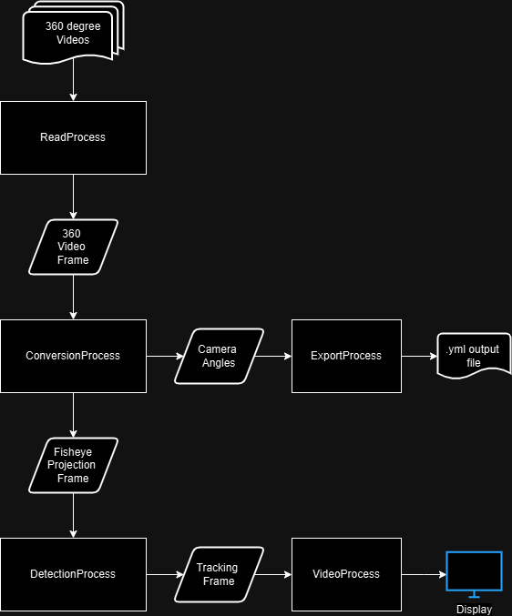

# 360 Video Processor
Custom python script for tracking a centering camera position on human subjects within 360 degree videos.

---------

## How it works

The purpose of the program is to convert 360 degree/Equirectangular video into a fisheye projection, track the motion of a human target intially centered in the video, and adjust the camera angles to always be centered on the target.

### Program Structure

The program is split up into five distint tasks that are handled respectively via multiprocessing. These include
1. Reading each frame from the input video files
2. Converting each frame from equirectangular to fisheye
3. Tracking human motion in the frame
4. Exporting camera angles (optional)
5. Displaying tracking video (optional)



---------

## Running the program

Using the program requires cloning the Github repo and running the script on your local system. A graphics card is required to run the ML skeleton tracker used in the system.

### Environment Setup

Once the repo is cloned, it is recommended to create a conda environment for managing the dependancies. The provided `environment.yml` file provides all the necessary dependancies and can be loaded in the conda environment once created.

### Config file

The list of videos and processing options for the program are passed via a `.yml` file. The file can be specified when launching the program, or the default file used is `config.yml`. An example config file is provided with the code.

The structure of the config file is specified below:

* `videos`: List of videos to process and their respective options
    * `input_data`: Options regarding input data
        * `in_file`: Video file name
    * `output_data`: Options regarding output data
        * `out_file`: File name for exported angle data
    * `conversion_info`:  Options regarding converting the video from equirectangle to fisheye projection
        * `f`: conversion parameter `f`
        * `a`: conversion parameter `a`
        * `xi`: conversion parameter `xi`
        * `initial_angle`: This initial camera angle, in a list
        * `output shape`: The size of the video frame after conversion, in a list
    * `detection_info`: Options regarding target tracking and detection
        * `bounding_box`: The intial bounding box size of the object tracker
* `options`: Options for the entirety of the program
    * `detection_info`: Options regarding target tracking and detection
        *`tracking_frames_per_detection`: How many frames before switching from object tracker to ml skeleton detector
        *`tracking_type`: Object tracker used. Currently supports KCF or CSRT
        *`ml_detector`: ML skeleton detector type
        *`visualize_bb`: Indicates if bounding boxes should be visualized
    * `video_control`: Options regarding keyboard control within video player
        * `exit_key`: Key for closing the video player
    * `show_vid`: Indicates if program should show video player of tracking progress
    * `export_data`: Indicates if angle data should be exported

### Launching

The script can be run in the terminal as follow:

```
python3 360_video_processor -o [config_file_name]
```

Where `-o`/`--options` specifies the name of the config file used. If none is specified, the default config file used is `config.yml`.

When launched, messages in the terminal will indicate the convertion progress and if the `show_vid` option is enabled, a video player will display the motion tracking.

If the `export_data` option is specified, you can view the camera angles used to center on the target within the output file specified in the `out_file` option.

---------

## Acknowledgements

I would like to thank [Hamid Mohammadi](https://github.com/sandstorm12) for the opportunity and guidance during this project